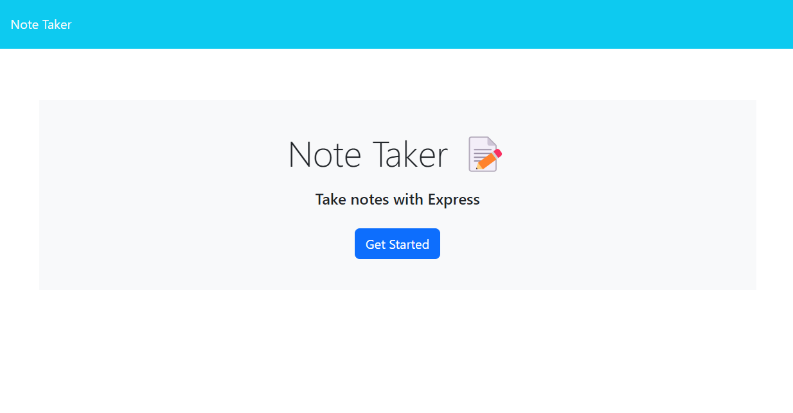

# Cuddly-Notes

Cuddly-Notes is a simple, cuddly note-taking web application that allows users to create, save, and delete notes. It's built with Node.js and Express and can be easily deployed to Heroku for accessible, on-the-go note management.

## Table of Contents
- [Features](#features)
- [Preview](#usage)
- [Installation](#installation)
- [Deployment](#deployment)
- [Built-With](#built-with)
- [Questions](#questions)
- [License](#license)

## Features

- Create and save notes
- View list of saved notes
- Delete notes no longer needed
- Responsive design for desktop and mobile use

## Preview



## Getting Started

These instructions will get you a copy of the project up and running on your local machine for development and testing purposes.

### Prerequisites

What things you need to install the software and how to install them:

- node.js
- npm
- git

### Installing

A step by step series of examples that tell you how to get a development environment running:

1. Clone the repository:

```
git clone https://github.com/hokage-216/cuddly-notes.git
```


2. Navigate to the project directory:

```
cd cuddly-notes
```


3. Install dependencies:

```
npm install
```


4. Start the server:

```
npm start
```


Visit http://localhost:5001 in your browser, and you should see the application running.

## Deployment

To deploy Cuddly-Notes to Heroku, follow these steps:

1. 

```
heroku create
```

2. 

```
git push heroku master
```

3. 

```
heroku open
```

## Built With

- Node.js - The JavaScript runtime environment
- Express.js - Web application framework
- Heroku - Cloud platform for deployment

## Questions

If you have any questions about the repo, open an issue or contact me directly at berrylevente@hotmail.com.

To view more of my work [click here](https://github.com/hokage-216/).

## License

Copyright (c) 2024 LeVente Berry Jr.

Licensed under the MIT license. To view the license terms [click here](https://opensource.org/licenses/MIT).

